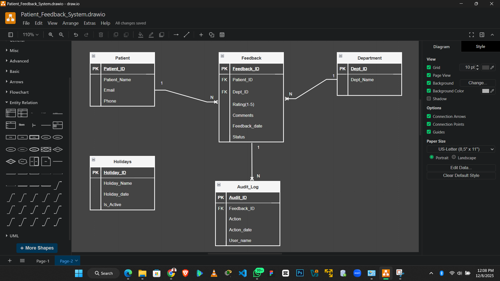
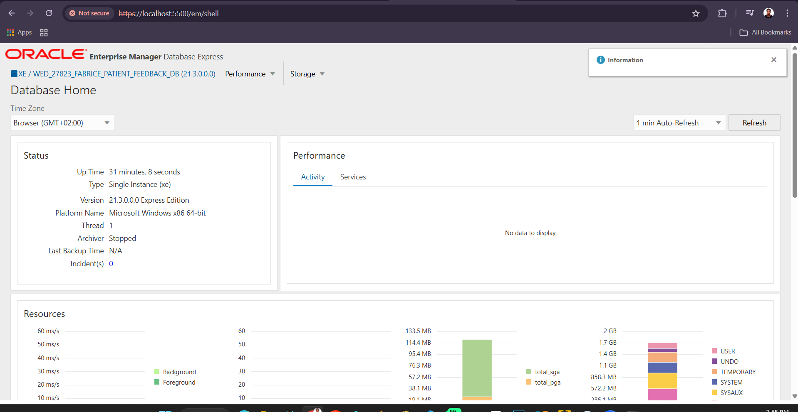

# PATIENT-FEEDBACK-TRACKING-SYSTEM

### PROJECT TITLE : Patient Feedback Tracking System
### NAME : MUCYO Fabrice
### ID : 27823
### COURSE : Database Development with PL/SQL

----
## PHASE 1: 
## PROBLEM STATEMENT
Hospitals use paper forms for patient feedback which get lost and provide no analytics and this digital system stores all feedback securely, enforces business rules automatically and provides actionable insights for service improvement and also this system will help to secure data like for the old ways some one who is not even registered as Patient could give a feedback without getting service and This system will also help the Hospital to receive Feedback from Registerd Patients who receive the service

### KEY OBJECTIVE
1. ✅ Digitize patient feedback collection
2. ✅ Implement business rules (no weekday/holiday changes)
3. ✅ Create comprehensive audit trail
4. ✅ Generate automated reports and analytics for every department
5. ✅ Build production ready PL/SQL database solution

### LINKS TO DOCUMENTATION
1. <a href="Documentation/data_dictionary.md">Data Dictionary</a>
2. <a href="Documentation/architecture.md">System Architecture</a>
3. <a href="Documentation/designing_decisions.md">Designing Decisions</a>
4. <a href="Business Intelligence/bi_requirements.md">BI Requirements</a>
5. <a href="Business Intelligence/kpi_definitions.md">KPI Definition</a>

## PHASE 2:
## BUSINESS PROCESS MODELING (BPMN)

# Patient Feedback Tracking System BPMN

## Process Purpose
This BPMN diagram shows how a hospital handles patient feedback from start to finish it ensures feedback is collected, reviewed, stored and reported in a structured way

## Main Elements of the Diagram

### **1. Start to Decision (Left Side)**
The process begins when a patient gives feedback. First, the system checks the patient's ID to make sure it's valid then it asks: "Is this feedback about a specific treatment?"
- **Yes → Goes to** "Receiver Medical Service"
- **No → Goes to** "Process Feedback"

This decision point helps route feedback to the right place

### **2. Processing Feedback (Middle)**
- **Receiver Medical Service:** If feedback is about a treatment the medical team receives it
- **Process Feedback:** General feedback is handled here
- **Another Decision:** "Is there any other treatment to review?"
  - **Yes →** Loops back to "Receiver Medical Service"
  - **No →** Moves forward

This loop allows patients to give feedback on multiple treatments at once

### **3. Saving Feedback**
After feedback is processed:
- **Update Feedback Status:** Marks it as reviewed
- **Log Feedback Change:** Keeps a record of what was done
- **Store Feedback in Database:** Saves it permanently

### **4. Management Reports (Bottom)**
Finally:
- **Generate Department Statistic:** Creates numbers and trends for each department
- **Generate Feedback Report:** Makes official reports
- **End:** Process Complete

## Who Does What
- **Patients** start the process
- **Medical Staff** review treatment related feedback
- **System or Admin** update, log, store and report

## Why This System Works
- It organizes feedback so nothing is missed
- It connects patients directly to their care teams when needed
- It saves everything securely
- It creates useful reports to help the hospital improve

## PHASE 3:
## LOGICAL DATABASE DESIGN (ER DIAGRAM)

# Data Dictionary

## PATIENTS Table
| Column | Type | Constraints | Purpose |
|--------|------|-------------|---------|
| PATIENT_ID | NUMBER(10) | PK, NOT NULL | Unique patient identifier |
| PATIENT_NAME | VARCHAR2(100) | NOT NULL | Patient's full name |
| EMAIL | VARCHAR2(100) | UNIQUE | Contact email address |
| PHONE | VARCHAR2(20) | | Contact phone number |

## DEPARTMENTS Table
| Column | Type | Constraints | Purpose |
|--------|------|-------------|---------|
| DEPT_ID | NUMBER(5) | PK, NOT NULL | Department identifier |
| DEPT_NAME | VARCHAR2(100) | NOT NULL, UNIQUE | Department name |

## FEEDBACK Table
| Column | Type | Constraints | Purpose |
|--------|------|-------------|---------|
| FEEDBACK_ID | NUMBER(10) | PK, NOT NULL | Unique feedback ID |
| PATIENT_ID | NUMBER(10) | FK → PATIENTS | Patient giving feedback |
| DEPT_ID | NUMBER(5) | FK → DEPARTMENTS | Department receiving feedback |
| RATING | NUMBER(1) | CHECK (1-5) | 1=Poor to 5=Excellent |
| COMMENTS | VARCHAR2(500) | | Patient comments |
| STATUS | VARCHAR2(20) | DEFAULT 'PENDING' | Current status |
| FEEDBACK_DATE | DATE | DEFAULT SYSDATE | Date submitted |

## AUDIT_LOG Table
| Column | Type | Constraints | Purpose |
|--------|------|-------------|---------|
| AUDIT_ID | NUMBER(10) | PK, NOT NULL | Audit record ID |
| FEEDBACK_ID | NUMBER(10) | FK → FEEDBACK | Related feedback |
| ACTION | VARCHAR2(10) | CHECK(INSERT/UPDATE/DELETE) | Operation type |
| USER_NAME | VARCHAR2(50) | | User performing operation |
| ACTION_DATE | TIMESTAMP | DEFAULT SYSTIMESTAMP | When operation occurred |

## HOLIDAYS Table
| Column | Type | Constraints | Purpose |
|--------|------|-------------|---------|
| HOLIDAY_ID | NUMBER(5) | PK, NOT NULL | Holiday identifier |
| HOLIDAY_NAME | VARCHAR2(100) | NOT NULL | Name of holiday |
| HOLIDAY_DATE | DATE | NOT NULL, UNIQUE | Date of holiday |
| IS_ACTIVE | CHAR(1) | DEFAULT 'Y' | Active status |

## Relationships
| Parent Table | Child Table | Foreign Key |	Relationship | Description                                        |
|--------------|-------------|-------------|---------------|----------------------------------------------------|
| PATIENTS	   | FEEDBACK	   | PATIENT_ID  |	1 to Many     | One patient can submit many feedback entries       |
| DEPARTMENTS	 | FEEDBACK	   | DEPT_ID	   |  1 to Many	   | One department can receive many feedback entries   |
| FEEDBACK	   | AUDIT_LOG	 | FEEDBACK_ID |	1 to Many	   | One feedback record can have many audit log entries|
| HOLIDAYS	   |             |             |  Independent   | Holiday table stands alone and has no FK relationships    |

## PHASE 4:
## DATABASE CREATION

### 1.Creating a Pluggable Database

### 2.Checking the Oracle Enterprise Manager

### 3.Creating the Table Spaces
Tablespaces are storage containers inside a database that control where data is physically stored on disk
#### Before Creating Tablespces we will first switch the container from CDB$ROOT to our pluggable database

####  After creating the TableSpaces we grant priveledge to the User we created

#### Create Connection of PDB in the SQL Developer

